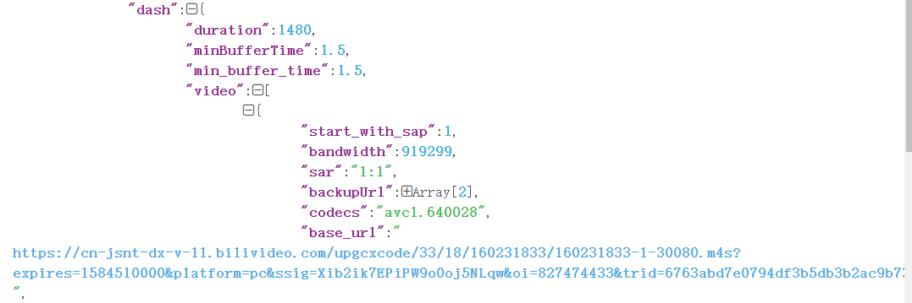

## 哔哩哔哩网站 [https://www.bilibili.com/](https://www.bilibili.com/)

### 1. 接口分析

#### 1.1 视频播放地址分析

找到一个接口地址 [https://api.bilibili.com/pgc/player/web/playurl?cid=160231833&qn=0&type=&otype=json&avid=82232111&ep_id=307446&fourk=1&fnver=0&fnval=16&session=744e6df0cb039ef30dfb85c20910ed8b](https://api.bilibili.com/pgc/player/web/playurl?cid=160231833&qn=0&type=&otype=json&avid=82232111&ep_id=307446&fourk=1&fnver=0&fnval=16&session=744e6df0cb039ef30dfb85c20910ed8b)

> 请求参数

```python
{
    "avid": "82232426",
    "cid": "140699463",
    "bvid": "",
    "qn": "80", # 这个应该表示的是视频的质量 16， 32， 64， 80， 112 不过试了一下112好像没啥用
    "type": "",
    "otype": "json",
    "ep_id": "307447", # 对应每一p集数 episode
    "fourk": "1",
    "fnver": "0",
    "fnval": "16",
    "session": "c1f003185cac135189816b9625e0880e",
}
```

根据这个接口返回的`json`数据找到了，视频的地址`base_url`还有`backup_url`（这个`backup_url`应该是一个备份的`url`地址）。

视频连接 [https://cn-jsnt-dx-v-11.bilivideo.com/upgcxcode/33/18/160231833/160231833-1-30080.m4s?expires=1584510000&platform=pc&ssig=Xib2ik7EPiPW9o0oj5NLqw&oi=827474433&trid=6763abd7e0794df3b5db3b2ac9b733a3p&nfc=1&nfb=maPYqpoel5MI3qOUX6YpRA==&mid=0](https://cn-jsnt-dx-v-11.bilivideo.com/upgcxcode/33/18/160231833/160231833-1-30080.m4s?expires=1584510000&platform=pc&ssig=Xib2ik7EPiPW9o0oj5NLqw&oi=827474433&trid=6763abd7e0794df3b5db3b2ac9b733a3p&nfc=1&nfb=maPYqpoel5MI3qOUX6YpRA==&mid=0)

```python
{
    "expires": "1584509100",
    "platform": "pc",
    "ssig": "etgIh6fzpyJHTk7x2UtAag",
    "oi": "827474433",
    "trid": "a719f43365ce4356a5df8a0380d10112p",
    "nfc": "1",
    "nfb": "maPYqpoel5MI3qOUX6YpRA==",
    "mid": "0",
}
```

当然，我觉得这里的参数不重要，因为可以直接通过i这个`json`文件获取，不需要自己传值。



接着添加必要的请求头`refer`（一定要加，否者会出现`453`状态码）还有`range: bytes=0-`（格式`range: byte=a-b`表示返回的是部分数据，数据范围为`a-b`字节，状态码为`206`，这里改为`0-`,表示请求全部的数据）当然还有`user-agent`。然后，得到了一个`mp4`文件。打开一看，没有声音，才想到是不是**视频和音频文件分开了**，于是又找到了，音频的地址`base_url`还有`backup_url` **返回的视频对象有8个应该是编码的不同，还有音频有3个，也是编码不同吧。对这个编码这块就不去研究了，我们默认取第一个。**

音频地址 [https://cn-jsnt-dx-v-10.bilivideo.com/upgcxcode/33/18/160231833/160231833-1-30280.m4s?expires=1584510000&platform=pc&ssig=7y7UFpphOOZ_21shPqx4mw&oi=827474433&trid=6763abd7e0794df3b5db3b2ac9b733a3p&nfc=1&nfb=maPYqpoel5MI3qOUX6YpRA==&mid=0](https://cn-jsnt-dx-v-10.bilivideo.com/upgcxcode/33/18/160231833/160231833-1-30280.m4s?expires=1584510000&platform=pc&ssig=7y7UFpphOOZ_21shPqx4mw&oi=827474433&trid=6763abd7e0794df3b5db3b2ac9b733a3p&nfc=1&nfb=maPYqpoel5MI3qOUX6YpRA==&mid=0)

```python
{
    "expires": "1584509100",
    "platform": "pc",
    "ssig": "Xib2ik7EPiPW9o0oj5NLqw",
    "oi": "827474433",
    "trid": "a719f43365ce4356a5df8a0380d10112p",
    "nfc": "1",
    "nfb": "maPYqpoel5MI3qOUX6YpRA==",
    "mid": "0",
}
```

视频和音频参数主要的不同在`ssig`这个参数上


接下来就要考虑视频和音频的合并了，百度一下，了解到需要使用`ffmpeg`这个工具，[下载](https://ffmpeg.zeranoe.com/builds/)。配置变量，这样就可以在命令行中的任意位置使用，将`bin`目录配置在`path`环境变量中


这是安装成功的截图

接下来要安装`python`的库`ffmpy3`来使用它，当然你也可以不然装，通过`python`命令行的方式来运行这个软件的相关的命令。`pip install ffmpy3` 

`ffmpeg`基本用法 `usage: ffmpeg [options] [[infile options] -i infile]... {[outfile options] outfile}...`

将视频和音频合在一起的命令`cmd`: `ffmpeg -i a.mp3 -i b.mp4 c.mp4` 将`a`和`b`合并为`c`

使用的`ffmpy3`代码为`ffmpy3.FFMPEG(inputs={"a.mp3": None, "b.mp3": None}, outputs={"c.mp3": None})`

视频和音频合成之后播放成功，一个小目标达成。^_^

#### 1.2 找到`ep_id`

因为在请求播放地址的接口主要的参数只有`ep_id`，所以，接下来就要找到，这个`ep_id`。经过一点点的小插曲，找到了这个`ep_id`。可以在控制台中输入`__INITIAL_STATE__`查看关于这个番剧的所有信息。


得到这个数据的接口就是 [https://www.bilibili.com/bangumi/play/ss29310?spm_id_from=xxxxxxx](https://www.bilibili.com/bangumi/play/ss29310?spm_id_from=xxxxxxx) 其中后面这个`spm_id_from`参数没用，应该记录的是，你从哪一个入口，进来的。注意到：路径中有一个`ss29310`应该是这个番剧的`id`值。关于番剧的`id`如何获取，下面在分析。现在首先得到`ep_id`。由于这个值，是在`html`页面的脚本中的，所以，可以通过页面解析拿到。具体怎么拿，应该都会把。不会看我的`github`上的源码。

#### 1.3 找到`ssId`

经过上面的几个部分，已经基本能够下载番剧了。但是我们还可以提供一个根据名字下载番剧的`api`吧。不难找到

[https://api.bilibili.com/x/web-interface/search/all/v2]([https://api.bilibili.com/x/web-interface/search/all/v2)

参数

```python
{
    "context": "",
    "page": "1", # 页数
    "order": "",
    "keyword": "异度侵入", # 关键词
    "duration": "",
    "tids_1”: "",
    "tids_2”: "",
    "__refresh__": "true",
    "__reload__": "false",
    "highlight": "1", # 是否带有html标签修饰
    "single_column": "0",
    "jsonp": "jsonp", # jsonp请求
    "callback": "__jp3", # 回调函数的名字
}
```


不难看到，这是一个解决跨域问题的`jsonp`的请求。经过测试，提取一些参数 [https://api.bilibili.com/x/web-interface/search/all/v2?page=1&keyword=异度侵入](https://api.bilibili.com/x/web-interface/search/all/v2?page=1&keyword=异度侵入)


### 2. 写业务代码

预知后事如何，请移步到我的`gtihub`

运行截图

